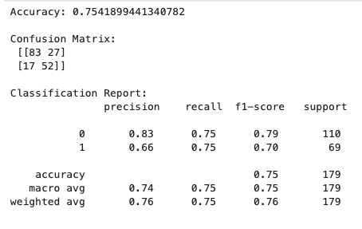
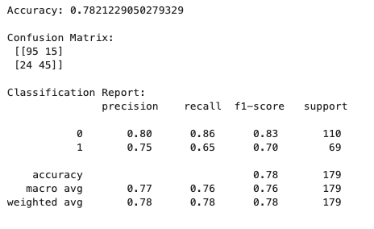

# 🚢 Titanic Survivors Classifier  

🔗 **Live Demo:** [https://titanic-survivors-classifier.onrender.com](https://titanic-survivors-classifier.onrender.com)

---

## 📋 Project Objective  

Predict whether a passenger survived the Titanic disaster based on key demographic and ticket-related features.  
Compare different classification algorithms — **Decision Tree**, **Random Forest**, and **XGBoost** — to identify which achieves the best balance between accuracy and interpretability.

---

## 🧩 Workflow Overview  

The project follows a full **Machine Learning pipeline**:

- Exploratory Data Analysis (EDA)  
- Data cleaning and encoding  
- Feature selection  
- Model training and evaluation (Decision Tree, Random Forest, XGBoost)  
- Cross-validation and optimization  

---

## 1️⃣ Exploratory Data Analysis and Data Preparation  

**Dataset:** Kaggle — “Titanic: Machine Learning from Disaster”  

**Initial Features:**  
`PassengerId`, `Survived`, `Pclass`, `Name`, `Sex`, `Age`, `SibSp`, `Parch`, `Ticket`, `Fare`, `Cabin`, `Embarked`

### 🔍 Cleaning & Transformation
- Removed irrelevant columns: `PassengerId`, `Name`, `Ticket`, `Cabin`  
- Filled missing values:  
  - `Age` and `Fare` → median  
  - `Embarked` → mode  
- Encoded categorical features:  
  - `Sex` → (0 = Male, 1 = Female)  
  - `Embarked` → label-encoded  
- Final selected features:  
  `Pclass`, `Sex`, `Age`, `SibSp`, `Parch`, `Fare`


### Correlation heatmap (after cleaning)


---

## 2️⃣ Decision Tree Classifier  

### Data Split
```python
from sklearn.model_selection import train_test_split
X = df[["Pclass", "Sex", "Age", "SibSp", "Parch", "Fare"]]
y = df["Survived"]
X_train, X_test, y_train, y_test = train_test_split(X, y, test_size=0.2, stratify=y, random_state=42)
```


### 2.2 Train & Evaluate

Model hyperparam **class_weight="balanced"** balances the model’s learning by making the model “pay equal attention” to both survivors and non-survivors.

- Gives more importance (weight) to the minority class during training.
- Prevents the model from simply favoring the majority class.

```python
from sklearn.tree import DecisionTreeClassifier
from sklearn.metrics import accuracy_score, classification_report, confusion_matrix

model=DecisionTreeClassifier(random_state=42, class_weight="balanced")
model.fit(X_train, y_train)
from sklearn.metrics import accuracy_score, classification_report, confusion_matrix

y_pred = model.predict(X_test)

print("Accuracy:", accuracy_score(y_test, y_pred))
print("\nConfusion Matrix:\n", confusion_matrix(y_test, y_pred))
print("\nClassification Report:\n", classification_report(y_test, y_pred))
```
**Results**


### 2.3 Optimize

Here, we introduce an optimization hyperparam **max_depth=3**

```python
model=DecisionTreeClassifier(random_state=42, class_weight="balanced", max_depth=3)
model.fit(X_train, y_train)
y_pred=model.predict(X_test)
print("Accuracy:", accuracy_score(y_test, y_pred))
print("\nConfusion Matrix:\n", confusion_matrix(y_test, y_pred))
print("\nClassification Report:\n", classification_report(y_test, y_pred))
```



## 3. RANDOM FOREST - Model Trining & Evaluation (Random Forest)

Random forest with k-fold evaluation

```python
from sklearn.ensemble import RandomForestClassifier
from sklearn.model_selection import cross_val_score
import numpy as np

rf = RandomForestClassifier(
    n_estimators=100,
    class_weight="balanced",
    random_state=42,
    max_depth=3
)

scores = cross_val_score(rf, X, y, cv=5, scoring="accuracy")
print("Cross-Validation Accuracies:", np.round(scores, 3))
print("Mean Accuracy:", np.mean(scores).round(3))
```
**Results**
Cross-Validation Accuracies: [0.771 0.815 0.803 0.781 0.854]
Mean Accuracy: 0.805


### 3.1 Optimizing Random Forest

- Add 2 features previouly dropped "SibSp", "Parch" & "Fare"

   - Added family-related features (SibSp, Parch) ---> Captures social survival patterns — people with family had higher chance of survival.
   - Added Fare earlier ---> Captured wealth proxy. Wealthier = more chances of survival


**Results**
Cross-Validation Accuracies: [0.816 0.803 0.837 0.837 0.843]
Mean Accuracy: **0.83**


## 3. XGBoost Classifier (Extreme Gradient Boosting)

XGBoost was trained using the same features as the Random Forest model.  
It applies **boosting**, meaning each new tree learns from the errors of the previous one.

Despite tuning, XGBoost achieved **comparable but not superior performance**, likely due to the **small dataset size** and **low feature complexity**.

**Results**

```python
xgb_final = XGBClassifier(
    n_estimators=200,
    learning_rate=0.15,     # slightly faster convergence
    max_depth=3,            # smaller trees for low-variance data
    subsample=0.9,
    colsample_bytree=0.9,
    gamma=0.0,              # allow freer splits
    reg_lambda=1.0,         # L2 regularization (stability)
    reg_alpha=0.0,          # no L1 pruning
    random_state=42,
    use_label_encoder=False,
    eval_metric='logloss'
)

scores = cross_val_score(xgb_final, X, y, cv=5, scoring="accuracy")
print("Cross-Validation Accuracies:", np.round(scores, 3))
print("Mean Accuracy:", np.mean(scores).round(3))
```
**Results**
Cross-Validation Accuracies: [0.776 0.783 0.831 0.859 0.789]
Mean Accuracy: 0.81


| Model | Mean Accuracy | Notes |
|--------|----------------|--------|
| Decision Tree | 0.80 | Simple, interpretable baseline |
| Random Forest | **0.827** | Most stable and generalizable |
| XGBoost | 0.805 | Comparable accuracy; small data limits boosting gains |

📈 **Insight:**  
On compact tabular datasets, **Random Forest often matches or slightly outperforms XGBoost** because bagging is less prone to overfitting.  
With larger, more complex data, XGBoost would likely outperform it.

---

Would you like me to update your README.md with this realistic explanation — emphasizing that XGBoost performs comparably *due to dataset constraints*, not model weakness?
